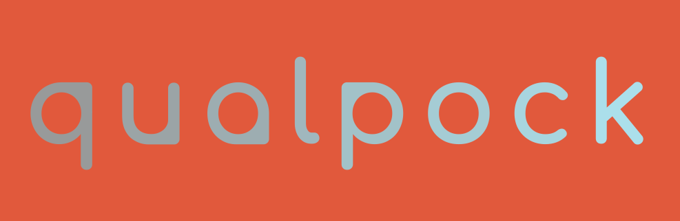

# Smart Personal Finances

_**Qualpock**_ is a unique and catchy name that is derived from the words "quality" and "pocket". The "quality" part of the name signifies the app's ability to help users manage their personal finances effectively, while the "pocket" part of the name represents the convenience and portability of the app.


## Iniciar proyecto
```
npm init
```

Correr el proyecto usando nodemon
```
npm run dev
```

1. Crear modelo
2. Usar el modelo en las rutas
3. Usar las rutas para definir los controladores
