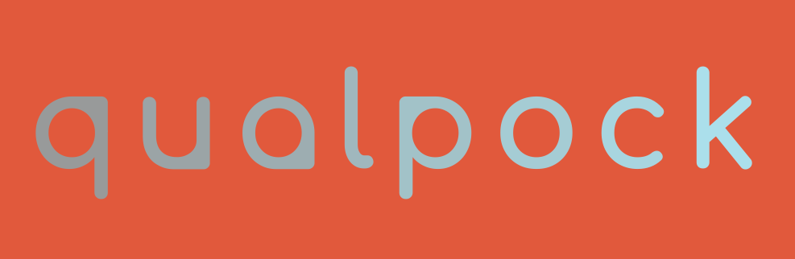

# _Finanzas personales conscientes_

_**Qualpock**_ es un nombre pegadizo que deriva de las palabras "calidad" y "bolsillo". El nombre hace referencia a la capacidad de la API para ayudar a los usuarios a gestionar sus finanzas personales con comodidad y portabilidad.

https://qualpock-api.onrender.com

# Setup
Para correr el proyecto de manera local

```sh
git clone https://github.com/BioDani/projectWWC.git
```
Navege hasta la carpeta que almacena la versión V.2.1.0 de la aplicación.

```sh
projectWWC % cd project_V2.0
```


1. Crear modelo
2. Usar el modelo en las rutas
3. Usar las rutas para definir los controladores


```bash
npm install express mongoose dotenv 
```

```bash
sudo npm install --save-dev eslint eslint-config-prettier eslint-config-standard eslint-plugin-import eslint-plugin-n eslint-plugin-promise husky lint-staged nodemon prettier
```

```json
{
  "id_user": "60c9e10d8a15e50c3c87a3e0", // ID de usuario existente en la colección 'users'
  "account_name": "Mi cuenta",
  "account_type": "Tipo de cuenta",
  "account_balance": 1000,
  "account_currency": "USD",
  "account_transactions": [
    {
      "initial_value": 1000,
      "transaction_value": -500,
      "account_balance": 500,
      "date_transaction": "2023-06-14T00:00:00Z"
    },
    {
      "initial_value": 500,
      "transaction_value": 200,
      "account_balance": 700,
      "date_transaction": "2023-06-15T00:00:00Z"
    }
  ]
}

```


Contraseña: Al menos 8 caracteres
Al menos una letra minúscula
Al menos una letra mayúscula
Al menos un dígito
No puede contener espacios en blanco
